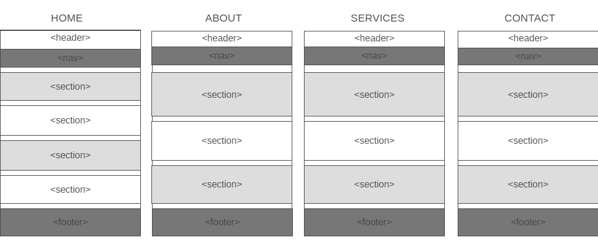

# Development Strategy

> `app-theme`

A website created to learn more about HTML semantic layout, CSS3, FlexBoxGrid and how to work with branches on GitHub for the purpose of team-collaboration.

## Wireframe

## 0. Set-Up

__A User can see my initial repository__

### Repo

- Generate from this [Template](https://github.com/HackYourFutureBelgium/w3-validation-template)  
- Turn on GitHub Pages
- Clone the repo

## 1. Create the title and the navigation bar of the website

__A site visitor can see the title and the main navigation bar of the website__

### Repo

Done on the branch `home-header-nav`

### HTML

* Added header of the HOME-page
* Added navbar of the HOME-page

### CSS

* Added global style rules
* Added style rules for the header
* Added style rules for the navbar

## 2. Create the main section of the HOME-page

__A site visitor can see the central section of the HOME-page with the background picture__

### Repo

Done on the branch `home-showcase-sec`

### HTML

* Added showcase section of the HOME-page

### CSS

* Added style rules for the showcase section

## 3. Create the features section of the HOME-page

__A site visitor can see the six core features with the icons and short description__

### Repo

Done on the branch `home-features-sec`

### HTML

* Added features section of the HOME-page

### CSS

* Added style rules for the features section

## 4. Create the info section of the HOME-page

__A site visitor can see the six core features with the background-picture and the picture of an Iphone__

### Repo

Done on the branch `home-info-sec`

### HTML

* Added info section of the HOME-page

### CSS

* Added style rules for the info section

## 5. Create the company section of the HOME-page

__A site visitor can see how to contact the company, short introduction to the company and can subscribe to the newsletter__

### Repo

Done on the branch `home-company-sec`

### HTML

* Added company section of the HOME-page

### CSS

* Added style rules for the company section

## 6. Create the footer of the HOME-page

__A site visitor can see copyrights on the bottom of the HOME-page__

### Repo

Done on the branch `home-footer`

### HTML

* Added footer of the HOME-page

### CSS

* Added style rules for the footer

## 7. Create ABOUT-page

__A site visitor can see ABOUT-page with the info about the company and company contact-info__

### Repo

Done on the branch `about-page`

### HTML

* Added about-page HTML

### CSS

* Added style rules for the about-page

## 8. Create SERVICES-page

__A site visitor can see SERVICES-page with the main product of the company and the company contact-info__

### Repo

Done on the branch `services-page`

### HTML

* Added services-page HTML

### CSS

* Added style rules for the services-page

## 9. Create CONTACT-page

__A site visitor can see CONTACT-page with a form to get in touch and the company contact-info__

### Repo

Done on the branch `contact-page`

### HTML

* Added contact-page HTML

### CSS

* Added style rules for the contact-page

## 10. Make website responsive

__A site visitor can see that the page adjusts to the different display sizes to optimize the experience using the website__

### Repo

Done on the branch `responsive`

### HTML

* There is no HTML added
  
### CSS

* Added media queries

## 11. Finishing Touches

### Repo

Done on the branch `final-touches`

* Final, complete README
* Development-strategy
* Check for any last mistakes
